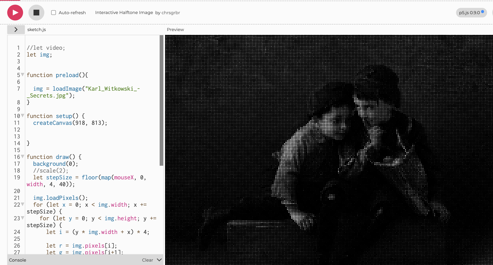

# atah0709_9103_tut3

# Quiz 8 Submission: Imaging and Coding Technique Exploration

## Part 1: Imaging Technique Inspiration

Halftone printing, inspired by Roy Lichtenstein's pop art that mimics comic book dots for shading, converts continuous tones into patterns of varying dot sizes. This technique suits the assignment by transforming the Mona Lisa into a dotted abstraction in p5.js, enabling interactive exploration of print media effects and grayscale conversion for artistic reinterpretation.

## Part 2: Coding Technique Exploration

Implement halftone in p5.js by analyzing image brightness per pixel, mapping values to circle sizes in a grid, and drawing dots with fill(). Use pixel array access and loops for efficiency, adding mouse interaction to adjust dot density or color accents. This builds on segmentation by emphasizing tonal gradients through geometric patterns.

Example code implementation: [Interactive Halftone](https://editor.p5js.org/chrsgrbr/sketches/mLNDLCYys)

Screenshot showcasing the coding technique: 